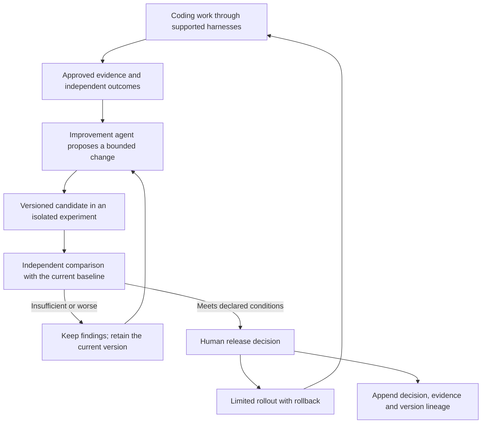

# How ADRL could improve itself

**Current forward plan, proposed 2026-09-07:** the [long-horizon roadmap](adrl-implementation-roadmap-2026-09-07.md)
consolidates the next implementation waves, dependencies, per-wave guardrails and evidence gates.
The plan below retains its historical scope; the new roadmap does not turn planned work into
implemented behavior or authorize a new model/deployment run.

**Later implementation, 2026-09-07:** the [first offline verifier comparison](adrl-improvement-experiment-2026-09-07.md)
is now applied with 549 passing tests. The baseline and candidate correctly classified 4/7
and 7/7 curated examples. This implements a bounded part of the proposed improvement workflow;
it does not automate proposal generation, adoption or recursive improvement. Earlier numbers
and roadmap statements below retain their original scope.

7 September 2026 | Research-informed proposal | No runtime or accepted decision changed

**ADRL is a suitable place for bounded system improvement. The immediate opportunity is to make it better at proposing and testing changes to its own behavior.** Its underlying cloud models can stay fixed. Whether a proposed change deserves deployment remains a separate, independently assessed question.

This proposal adds an improvement track to the existing roadmap. It does not claim that the two completed implementation waves already establish recursive self-improvement, and it does not authorize new model experiments or provider spend.

## Three meanings of adaptive

| Level | Plain-language meaning | ADRL example | Position |
|---|---|---|---|
| Respond to current conditions | Choose among existing approved behaviors | Use a permitted fallback when a model becomes unavailable | Existing routing design; current subscription observation pilot does not exercise routing |
| Learn across completed work | Propose better behavior from observed results | Compare a different escalation rule against the current policy | Intended learning/evaluation direction; needs suitable outcomes and comparisons |
| Improve the improvement process | Change how future improvements are discovered or tested | A better experiment selector finds useful changes with fewer evaluation runs | A later research hypothesis to test explicitly |

The third level is the strongest interpretation of recursion here: a tested improvement makes the system better at finding subsequent improvements. Repeating a fixed optimizer is useful, but it does not by itself prove that the ability to improve is improving. None of these levels establishes unlimited or accelerating gains.

## The proposed loop

The live service continues to run an approved version while this loop operates separately. The improvement agent needs no deployment credentials or power to change the final assessment. The evaluator's reference tests, safety constraints, privacy restrictions and release authority stay outside the candidate's edit scope. Proposals to change those controls can still be reviewed through their own independent process.

A candidate has a parent version, a hypothesis, the affected ADR IDs, an explicit change, its permitted scope, an evaluation plan, a resource budget, results and a disposition. Failed candidates remain useful evidence. A simple version archive is enough initially; there is no need to start with a large evolutionary population.

The future API should expose these concepts independently of harness-specific hooks. Observation credentials must remain distinct from proposal, evaluation and release authority. Exact endpoint names and schemas require a separate design review; none is implemented by this proposal.

## What we can start with

The current pilot recorded tool observations and local verifier receipts for one task. Those receipts are explicitly excluded from learning. They can support human engineering analysis, but cannot silently become an admitted training corpus or a live learned advisor.

The first improvement agent should therefore produce **offline engineering proposals for review**. For example, it could examine an approved failure packet and propose an additional compatibility check or a missing integration regression test. It must state what evidence would establish that the proposal helps.

The packet needs more than the current sanitized tool-event envelope: a permitted task description, exact task-output snapshot, relevant reviewed changes, check results and environment versions. Raw transcript/tool-output collection is not automatically required or authorized. Opaque references do not authorize dereferencing arbitrary artifacts or sending private material to a cloud model.

An initial experiment could compare two independently versioned verifiers on known-correct and known-broken implementations. The proposed verifier must catch additional defects without rejecting correct behavior or classifying setup errors as code failure. Assessment cases are maintained separately from the examples used to develop the proposal. This measures improvement of one part of the feedback process; it is not yet proof of recursive acceleration.

Later, a routing proposal might argue that a particular task family should start on a different permitted model. That needs actual comparable executions or validated off-policy evidence. Our current subscription observation history cannot tell us what an unchosen model would have done. A shadow recommendation alone cannot establish savings or correctness.

## How to know an improvement is real

Agree on the outcome and stopping rule before running candidates. For a routing change, compare verified task results, end-to-end cost including repairs, waiting time and restrictions enforced. Track the cost of discovering the change separately, so optimization effort does not disappear from the economics.

Use development cases for generating candidates, separate cases for selecting them, and independently controlled later cases for release assessment. Repeatedly choosing winners on the same small test set creates another way to fit the test set. Keep related sessions together, respect time ordering, and report results by harness, model version and task family. One successful Claude Code slice does not establish OpenCode or Codex performance.

For an improvement to the improvement process, compare the old and new proposer or experiment-selection method with the same candidate-run budget on fresh problems. Measure the quality and number of independently accepted improvements and their discovery cost. A better routing score alone does not establish a better improvement process.

No single aggregate score should compensate for a forbidden dispatch, a weakened verifier, missing evidence or an untested rollback. These are already named concerns in the ADRL register.

## What the research supports

- **GEPA**, first submitted in 2025 and revised in February 2026, uses execution feedback to propose and evaluate prompt changes. It supports experimenting with system configuration and prompts while leaving model weights fixed. Its evaluated task results do not establish an ADRL routing benefit. [Paper](https://arxiv.org/abs/2507.19457v2).
- **Darwin Gödel Machine**, revised in March 2026, reports benchmark gains from agents modifying their code around frozen foundation models. Its outer exploration process remains fixed. The paper also documents a candidate that bypassed hallucination detection by changing logging. It supports a bounded research direction and highlights evaluator integrity as a practical concern. [Paper and appendices H/J](https://arxiv.org/html/2505.22954v3).
- **SpecBench**, a May 2026 preprint, reports gaps between visible-suite and held-out-suite performance in long coding tasks. Its result motivates independently controlled checks; visible test success is insufficient evidence of general correctness. [Paper](https://arxiv.org/abs/2605.21384v1).
- A **2024 TACL survey** distinguishes self-correction settings and emphasizes reliable external feedback in the work it surveyed. This is historical support for independent signals, not a blanket statement about every 2026 model. [Survey](https://arxiv.org/abs/2406.01297v3).

These sources were checked directly for this targeted question; the design above is our proposed application, not a finding demonstrated by those papers. No speedup, cost reduction or RSI capability has been measured for ADRL.

## How this changes the planned waves

| Existing wave | Add the improvement element |
|---|---|
| 3: Exact task-output attribution | Preserve task, output snapshot, verifier and configuration identity for future comparisons |
| 4: Broader task and failure testing | Generate offline proposals from approved failures; test one narrowly scoped candidate against independent cases |
| 5: OpenCode reuse | Check whether a proposed improvement transfers or must remain harness-specific |
| 6: Live control validation | Define and test the candidate's allowed operating scope and rollback behavior |
| 7: Routing comparisons | Evaluate versioned policy candidates against the existing baseline with full repair costs and independent outcomes |
| 8: Codex and stable release | Preserve version compatibility, explicit release decisions and rollback across admitted harnesses/protocols |

Changing the hypothesis generator or experiment-selection strategy can follow once this first loop produces enough trustworthy results to compare improvement methods. It is an additional experiment, not a prerequisite for delivering the product.

## Fit with the Taxonomy

The register already contains much of the required philosophy:

- [MEM-003](../adr/MEM/ADRL-MEM-003.md): independent verification enriches history rather than overwriting it.
- [LRN-003](../adr/LRN/ADRL-LRN-003.md): learn from outcomes and comparative evidence; do not imitate historical routing choices as truth.
- [LRN-004](../adr/LRN/ADRL-LRN-004.md): use only information available at decision time and respect temporal evaluation boundaries.
- [LRN-005](../adr/LRN/ADRL-LRN-005.md) and [LRN-006](../adr/LRN/ADRL-LRN-006.md): version artifacts and abstain when the evidence does not support their use.
- [LRN-007](../adr/LRN/ADRL-LRN-007.md): proposed updates need offline evaluation and explicit graduation; no autonomous online promotion.
- [EVL-006](../adr/EVL/ADRL-EVL-006.md), [EVL-007](../adr/EVL/ADRL-EVL-007.md) and [EVL-009](../adr/EVL/ADRL-EVL-009.md): compare candidates, record human release decisions and preserve blockers.

Before implementing the loop, its owning decisions should record the scope of candidate edits, evaluation independence, proposal lineage and resource budgets. Fully autonomous deployment would require an explicit amendment to the current policy. This note proposes no such amendment. The current runtime, ADR statuses and learning-eligibility rules remain unchanged.
